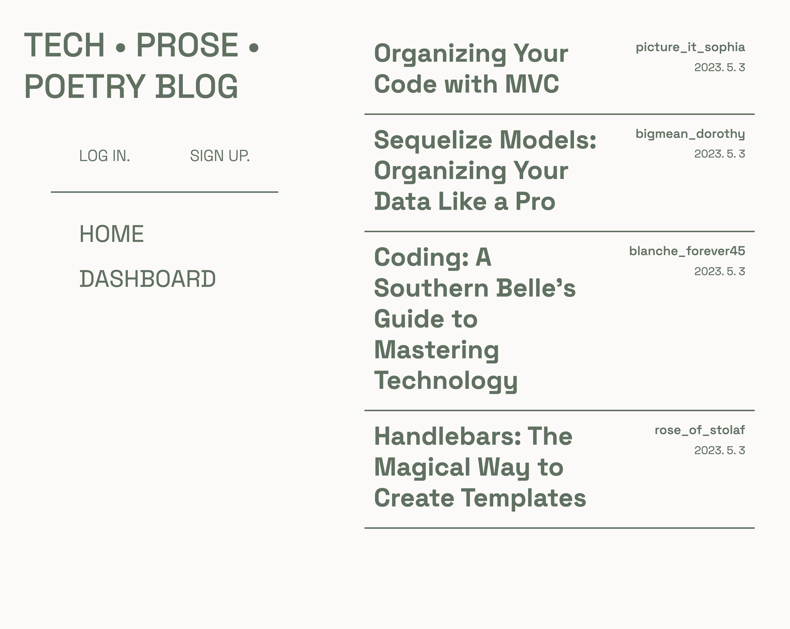
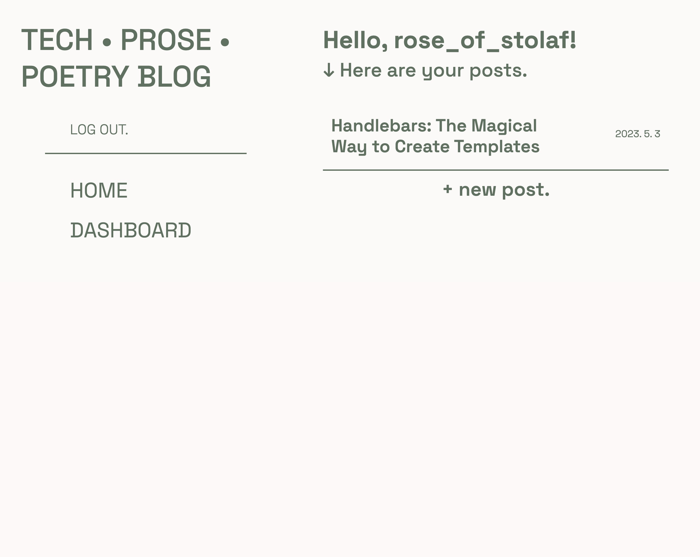
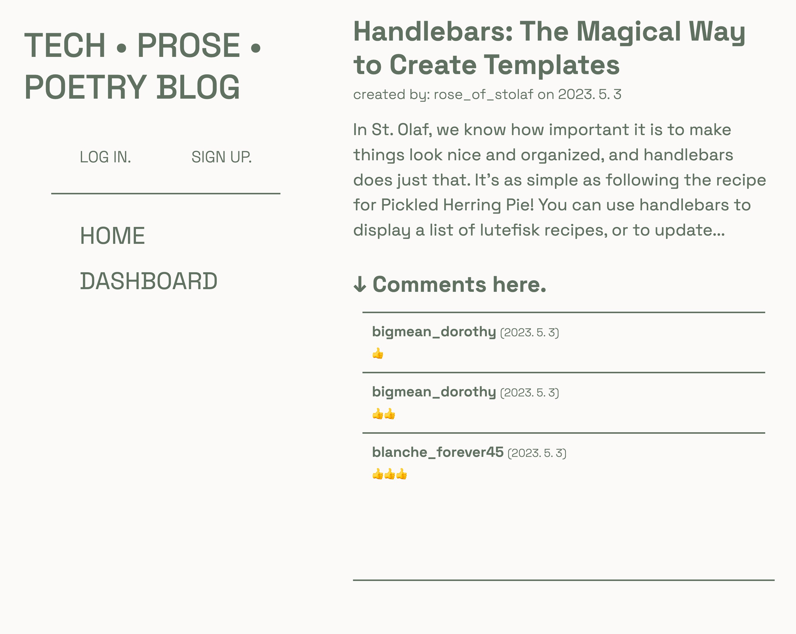

# Tech Blog

## Description

This application is a CMS-style blog that provides a space for developer to write about coding. Developers can not only share their knowledge about technical concepts, recent advancements, and new technologies, but also can share prose and poetry to express their feelings about coding.

## Installation

N/A

## Usage

To start, users should create an account, or log in if they have existing accounts. Blog posts can still be accessed without logging in; however, users are not able to edit, delete, or add comments. Once users log in (or create an account), users are taken to their dashboard where they can access their blog posts and write new posts. When users click on their posts in the dashboard, they have the option to delete or edit their post.

> Link to Deployed Application: https://evening-fjord-90217.herokuapp.com/

### Screenshots of Application

* Homepage

* Dashboard

* Blog Post with comments

## Credits

Special thanks to Scott McAnally for helping!

### Tutorials Referenced

* priyansh70890 - [Word and Character Counter using HTML CSS and Javascript](https://www.geeksforgeeks.org/word-and-character-counter-using-html-css-and-javascript/)

## License

This repository is licensed under the [MIT License](https://opensource.org/licenses/MIT).